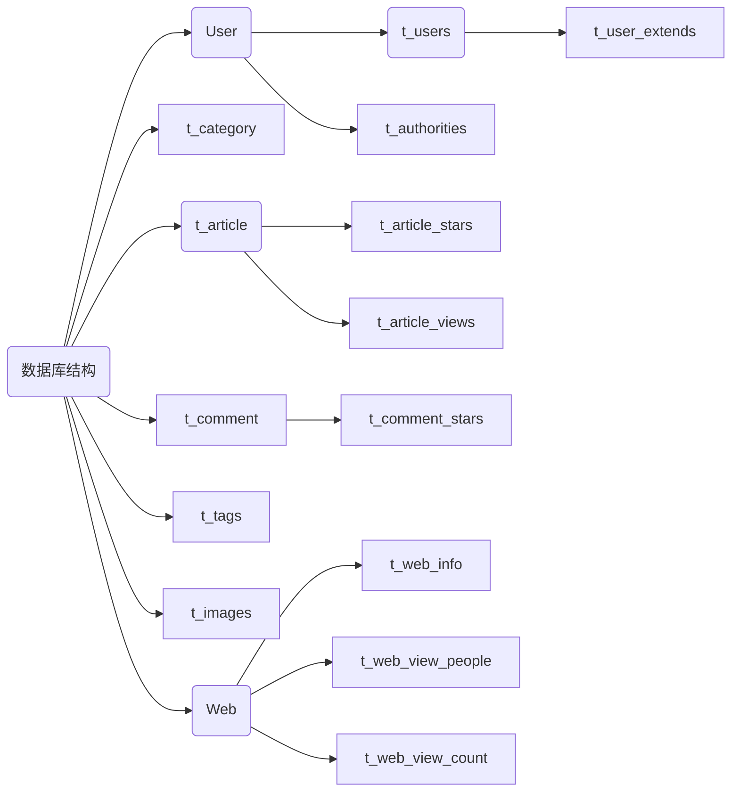
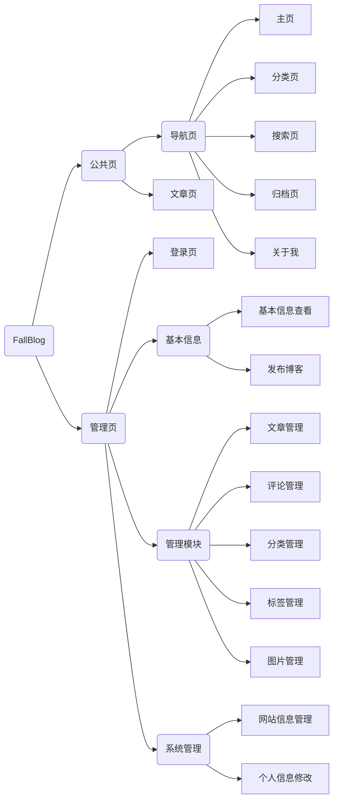

# Getting Started

### Reference Documentation

For further reference, please consider the following sections:

* [Official Apache Maven documentation](https://maven.apache.org/guides/index.html)
* [Spring Boot Maven Plugin Reference Guide](https://docs.spring.io/spring-boot/docs/2.5.3/maven-plugin/reference/html/)
* [Create an OCI image](https://docs.spring.io/spring-boot/docs/2.5.3/maven-plugin/reference/html/#build-image)
* [MyBatis Framework](https://mybatis.org/spring-boot-starter/mybatis-spring-boot-autoconfigure/)
* [Spring Configuration Processor](https://docs.spring.io/spring-boot/docs/2.5.3/reference/htmlsingle/#configuration-metadata-annotation-processor)
* [Spring Security](https://docs.spring.io/spring-boot/docs/2.5.3/reference/htmlsingle/#boot-features-security)
* [Spring Web](https://docs.spring.io/spring-boot/docs/2.5.3/reference/htmlsingle/#boot-features-developing-web-applications)
* [Spring Boot DevTools](https://docs.spring.io/spring-boot/docs/2.5.3/reference/htmlsingle/#using-boot-devtools)
* [Thymeleaf](https://docs.spring.io/spring-boot/docs/2.5.3/reference/htmlsingle/#boot-features-spring-mvc-template-engines)
* [MyBatis Plus](https://baomidou.com/)


### Js,Css插件

- [highlight.js](https://www.fenxianglu.cn/highlight.html)
- [highlight.css](https://cdnjs.com/libraries/highlight.js)
- [Bootstrap](https://v4.bootcss.com/docs/components/input-group/)
- [editor.md](http://editor.md.ipandao.com/examples/)
- 

### Guides

The following guides illustrate how to use some features concretely:

* [Accessing data with MySQL](https://spring.io/guides/gs/accessing-data-mysql/)
* [MyBatis Quick Start](https://github.com/mybatis/spring-boot-starter/wiki/Quick-Start)
* [Securing a Web Application](https://spring.io/guides/gs/securing-web/)
* [Spring Boot and OAuth2](https://spring.io/guides/tutorials/spring-boot-oauth2/)
* [Authenticating a User with LDAP](https://spring.io/guides/gs/authenticating-ldap/)
* [Building a RESTful Web Service](https://spring.io/guides/gs/rest-service/)
* [Serving Web Content with Spring MVC](https://spring.io/guides/gs/serving-web-content/)
* [Building REST services with Spring](https://spring.io/guides/tutorials/bookmarks/)
* [Handling Form Submission](https://spring.io/guides/gs/handling-form-submission/)


# 项目开发流程

- 2021/8/9 创建项目，添加相关依赖
- 2021/8/10 开始设计博客网站数据库结构
- 2021/8/11 初步完成博客网站数据库结构设计，开始编写相关sql语句
- 2021/8/16 完成博客网站数据库及实体类创建
- 2021/8/18 初步完成博客公共页的设计
- 2021/8/19 初步完成博客管理页的设计
- 2021/8/20 初步完成博客发布页面的设计，引入Editor.md，配置Mybatis代码生成器
- 2021/8/21 初步完成博客后台页面的编写改造
- 2021/8/22 初步完成博客的大致框架
- 2021/8/23 完善后台页面，首页分页删除多余的资源


# 项目

## 1. 数据库表结构设计

针对第一阶段，重新设计数据库




t_user 

| 字段名      | 类型     |
| ----------- | -------- |
| id          | varchar  |
| nickname    | varchar  |
| email       | varchar  |
| password    | varchar  |
| avatar      | varchar  |
| description | varchar  |
| status      | int      |
| version     | bigint   |
| create_time | datetime |
| update_time | datetime |

> 用户表，存储用户的相关信息

t_authorities

| 字段名      | 类型     |
| ----------- | -------- |
| id          | varchar  |
| email       | varchar  |
| authority   | varchar  |
| description | varchar  |
| status      | int      |
| version     | bigint   |
| create_time | datetime |
| update_time | datetime |

> 权限表，存储用户的相关权限

t_category

| 字段名      | 类型      |
| ----------- | --------- |
| id          | int       |
| name        | varchar   |
| description | varchar   |
| status      | int       |
| version     | bigint    |
| create_time | timestamp |
| update_time | timestamp |

> 分类表，存储文章分类

t_article

| 字段名      | 类型     |
| ----------- | -------- |
| id          | varchar  |
| title       | varchar  |
| user_id     | varchar  |
| description | varchar  |
| first_image | varchar  |
| category_id | int      |
| tags        | varchar  |
| content     | text     |
| status      | int      |
| version     | bigint   |
| create_time | datetime |
| update_time | datetime |

> 文章表，存储文章

t_article_views

| 字段名      | 类型     |
| ----------- | -------- |
| article_id  | varchar  |
| view_count  | bigint   |
| status      | int      |
| version     | bigint   |
| create_time | datetime |
| update_time | datetime |

> 用户每次浏览，都会增加浏览量，并不会刻意记住是谁点赞的

t_article_stars

| 字段名      | 类型     |
| ----------- | -------- |
| id          | varchar  |
| article_id  | varchar  |
| ip          | varchar  |
| device      | varchar  |
| status      | int      |
| version     | bigint   |
| create_time | datetime |
| update_time | datetime |

> 一旦点赞，就会存储点赞时间和对应的点赞ip，如果已经登录记录IP

t_comment

| 字段名      | 类型                                                         |
| ----------- | ------------------------------------------------------------ |
| id          | varchar                                                      |
| article_id  | varchar                                                      |
| nickname    | varchar                                                      |
| email       | varchar                                                      |
| content     | varchar                                                      |
| target      | 为空表示为一级评论，不为空根据id或者email排列到对应的一级评论下面，作为二级评论 |
| status      | int                                                          |
| ip          | varchar                                                      |
| device      | varchar                                                      |
| version     | bigint                                                       |
| create_time | datetime                                                     |
| update_time | datetime                                                     |

>  这里需要注意，需要邮箱验证码才可以评论

t_comment_stars

| 字段名      | 类型     |
| ----------- | -------- |
| id          | varchar  |
| comment_id  | varchar  |
| ip          | varchar  |
| status      | int      |
| version     | bigint   |
| create_time | datetime |
| update_time | datetime |

> 注册用户一旦点赞，就会存储点赞时间和对应的点赞人，非注册用户点赞，根据ip限制点击次数

> 为了确保不被冒用，需要发送邮件验证码

t_tags

| 字段名      | 类型     |
| ----------- | -------- |
| id          | bigint   |
| name        | varchar  |
| status      | int      |
| version     | bigint   |
| create_time | datetime |
| update_time | datetime |

t_web_info

采用key-value形式

| 字段名      | 类型     |
| ----------- | -------- |
| info_key    | varchar  |
| info_value  | varchar  |
| status      | int      |
| version     | bigint   |
| create_time | datetime |
| update_time | datetime |


t_web_view_people

| 字段名      | 类型     |
| ----------- | -------- |
| id          | varchar  |
| ip          | varchar  |
| device      | varchar  |
| status      | int      |
| version     | bigint   |
| create_time | datetime |
| update_time | datetime |

t_web_view_count

存储到web_info中

t_images

| 字段名      | 类型     |
| ----------- | -------- |
| id          | varchar  |
| url         | varchar  |
| path        | varchar  |
| name        | varchar  |
| type        | varchar  |
| status      | int      |
| version     | bigint   |
| create_time | datetime |
| update_time | datetime |

模糊搜索，查看是否有被引用，一段时间后删除

>注意：
>
>- 由于时间原因，文章点赞和star公共暂未实现，评论的star功能也未实现
>- t_user_extend表可以存储用户的扩展信息
>- 根据阿里巴巴的数据库设计规范，一张表应该包含主键id，状态status，create_time创建时间，update_time更新时间，version版本
> - 创建时间和更新时间这个和字面意思一样，就是记录修改时间，方便后期出现问题后查验
> - id主键，为了实现索引，以及唯一性，防止不必要的数据重复以及加快查询速度
> - version是为了实现乐观锁
> - status 通常删除数据并不会真的删除数据，毕竟用户的数据是很宝贵的，只是改变每条数据的状态

> 补充
>
> 乐观锁：假设数据不会出现冲突，只有在提交的那一刻才会检查，如果有冲突，则返回错误
>
> sql实现
>
> **update t_comment  set status=2,version=version+1 where id=#{id} and version=#{version};** 
>
> 理解：
>
> 假设不同的线程，或者不同的用户，根据相同的id查询出了同一条数据，假设version此时为1
>
> 这样用户a先更新数据，这时更新是成功的，version+1，此时version为2
>
> 然后用户b更新数据，传入的version还是1，但是实际上已经不存在version为1的数据了(由于a的更新，version已经为2了)，更新失败

## 网页设计



### 网站架构设计

第一阶段 只有一个用户 ，游客填写必要信息后评论   --> 前后端分离 Current

对于单用户来说，没有必要进行权限分离，只有用户表即可

第二阶段 多个用户，游客填写必要信息后评论，登录用户可以直接评论，其实没有什么意义，排除

第三阶段 多个用户，必须登录才能评论 ，公共页，个人管理页，管理员管理页  --> 前后端分离

本项目实现的是第一阶段的前后端不分离部分


## Springboot Boot整合Spring Security后产生的403拒绝访问问题

Ajax跨域问题，SpringSecurity

框架内部防止CSRF，限制了除get以外的大部分方法

解决方法：

- 关闭CSRF

- 放置CSRF令牌(推荐)

  ```html
  <meta name="_csrf" th:content="${_csrf.token}"/>
  <meta name="_csrf_header" th:content="${_csrf.headerName}"/>
  
  var token = $("meta[name='_csrf']").attr("content");
      var header = $("meta[name='_csrf_header']").attr("content");
      $(document).ajaxSend(function(e, xhr, options) {
          xhr.setRequestHeader(header, token);
      });
  
  $.ajax({
  url: url,
  method: 'DELETE',
  success: function(result) {
      $('#table').bootstrapTable('remove', {
          field: 'id',
          values: [row.id]
      });
  },
      error:function(result) {
      console.log(result);
  }
  ```

对应editor.md里面图片上传问题，

将plugins的image-dialog.js里面158行submitHandler方法块替换为

```js
var submitHandler = function() {

    // var uploadIframe = document.getElementById(iframeName);
    //
    // uploadIframe.onload = function() {
    //
    //     loading(false);
    //
    //     var body = (uploadIframe.contentWindow ? uploadIframe.contentWindow : uploadIframe.contentDocument).document.body;
    //     var json = (body.innerText) ? body.innerText : ( (body.textContent) ? body.textContent : null);
    //
    //     json = (typeof JSON.parse !== "undefined") ? JSON.parse(json) : eval("(" + json + ")");
    //
    //     if(!settings.crossDomainUpload)
    //     {
    //       if (json.success === 1)
    //       {
    //           dialog.find("[data-url]").val(json.url);
    //       }
    //       else
    //       {
    //           alert(json.message);
    //       }
    //     }
    //
    //     return false;
    // };

    let token = $("meta[name='_csrf']").attr("content")
    let hhhh = $("meta[name='_csrf_header']").attr("content")
    var form = dialog.find("[enctype=\"multipart/form-data\"]")[0];
    var formData = new FormData(form);
    $.ajax({
        type: 'post',
        // url: "http://localhost:8080/upload/test", // 你的服务器端的图片上传接口。如果你设置了 imageUploadURL，那么可以使用下面的方式
        url: settings.imageUploadURL + (settings.imageUploadURL.indexOf("?") >= 0 ? "&" : "?") + "guid=" + guid,
        // url: settings.imageUploadURL,
        // headers: {'Cookie' : document.cookie },
        headers: {'X-CSRF-TOKEN' : token },
        data: formData,
        cache: false,
        processData: false,
        contentType: false,
        success: function(data, textStatus, jqXHR) {
            // console.log(data);
            // console.log(textStatus);
            // console.log(jqXHR);
            if (data.success === 1) { // 上传成功
                dialog.find("[data-url]").val(data.url); // 设置图片地址
            }
            else {
                alert(data.message); // 上传失败，弹出警告信息
            }
        },
        error: function(XMLHttpRequest, textStatus, errorThrown) {
            // console.log(XMLHttpRequest);
            // console.log(textStatus);
            // console.log(errorThrown);
        }
    });

    loading(false);
    return false;
};
```

同源策略：协议(protocol)、端口(port)、主机(host)，必须都相同才是同源

网站信息包含浏览人数，浏览量，运行时间，开始运行日期，博客数量，评论数量，浏览人的设备信息，ip信息，

## 项目运行步骤

1. 运行fallblog.sql文件，创建数据库
2. 文章表插入相关数据，或者直接进入后台管理界面，创建分类后发布文章
3. 访问本地8081端口

## 关于本项目

1. 基于SpringBoot，SpringSecurity，Mybatis plus，Thymeleaf，Bootstrap的前后端不分离个人博客网站
2. 实现了最基本的CRUD以及权限拦截功能
   - 通过拦截器，添加全局的Thymeleaf动态变量
   - 通过SpringSecurity，实现权限拦截
   - 可以后期扩展RSA加密，保证用户登录时密码传输的安全性
3. 前端页面仍有很大的优化空间，实际上开发这个项目的时候，前端占用了超过一半的时间进行优化，再有就是数据库设计占用了一些时间，用来写后端的时间其实很少
4. 关于Service和Controller，在前后端分离的架构中，Service处理逻辑，Controller只负责数据接收和发送，比较容易实现，而且逻辑清晰，但是在前后端不分离的架构中，Controller和Service不需要分离的太彻底，比如Model给模板引擎传参就不要封装到Service，也尽量不要单独抽离出一个方法，因为这样首先是IDEA不会提示，其次是后面出了问题无法一眼就查找到问题所在
5. 关于文件存储，Java原生的其实逻辑就已经比较清晰了，可扩展性强，一些第三方插件也不过是做了些封装，本项目中，获取文件根目录是通过user.dir属性

